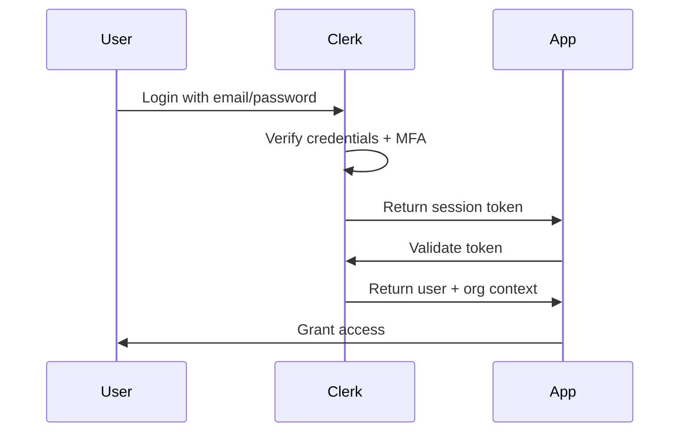

# Security & Authentication Documentation

This document provides comprehensive information about security measures, authentication systems, and best practices implemented in the Givance platform.

## Table of Contents
- [Overview](#overview)
- [Authentication Architecture](#authentication-architecture)
- [Multi-Tenant Security](#multi-tenant-security)
- [API Security](#api-security)
- [Data Encryption](#data-encryption)
- [OAuth Integrations](#oauth-integrations)
- [Security Headers & Policies](#security-headers--policies)
- [Input Validation](#input-validation)
- [Audit Logging](#audit-logging)
- [Security Checklist](#security-checklist)

## Overview

Givance implements defense-in-depth security with multiple layers:

1. **Authentication**: Clerk-based authentication with MFA support
2. **Authorization**: Role-based and organization-scoped access control
3. **Data Protection**: Encryption at rest and in transit
4. **Input Validation**: Comprehensive validation and sanitization
5. **Audit Trail**: Complete logging of sensitive operations

## Authentication Architecture

### Clerk Integration

Givance uses Clerk for enterprise-grade authentication:

```typescript
// src/app/lib/auth/clerk.ts

import { auth, currentUser, clerkClient } from '@clerk/nextjs';

export async function getAuthContext() {
  const { userId, orgId, orgRole, sessionClaims } = auth();
  
  if (!userId || !orgId) {
    throw new UnauthorizedError('Not authenticated');
  }
  
  return {
    userId,
    organizationId: orgId,
    role: orgRole,
    permissions: sessionClaims?.permissions || []
  };
}
```

### Authentication Flow



### Session Management

```typescript
// Middleware for protected routes
// src/middleware.ts

import { authMiddleware } from "@clerk/nextjs";

export default authMiddleware({
  publicRoutes: ["/", "/sign-in", "/sign-up", "/api/webhooks(.*)"],
  ignoredRoutes: ["/api/track(.*)"], // Public tracking endpoints
  
  afterAuth(auth, req) {
    // Redirect to sign-in if not authenticated
    if (!auth.userId && !auth.isPublicRoute) {
      return redirectToSignIn({ returnBackUrl: req.url });
    }
    
    // Ensure organization is selected
    if (auth.userId && !auth.orgId && req.nextUrl.pathname !== "/org-selection") {
      return NextResponse.redirect(new URL("/org-selection", req.url));
    }
  }
});
```

### User Roles & Permissions

```typescript
enum OrganizationRole {
  OWNER = 'org:owner',
  ADMIN = 'org:admin', 
  MEMBER = 'org:member',
  VIEWER = 'org:viewer'
}

interface Permissions {
  // Donor management
  'donors:read': boolean;
  'donors:write': boolean;
  'donors:delete': boolean;
  
  // Financial data
  'donations:read': boolean;
  'donations:write': boolean;
  'donations:delete': boolean;
  
  // Communications
  'communications:read': boolean;
  'communications:write': boolean;
  'communications:send': boolean;
  
  // AI features
  'ai:generate_emails': boolean;
  'ai:research_donors': boolean;
  'ai:analyze_journey': boolean;
  
  // Organization settings
  'organization:manage': boolean;
  'organization:billing': boolean;
}
```

## Multi-Tenant Security

### Data Isolation

All database queries are automatically scoped by organization:

```typescript
// src/app/lib/db/multiTenant.ts

export function createOrganizationScope(organizationId: string) {
  return {
    donors: {
      findMany: (args?: any) => db.query.donors.findMany({
        ...args,
        where: and(eq(donors.organizationId, organizationId), args?.where)
      }),
      
      create: (data: any) => db.insert(donors).values({
        ...data,
        organizationId
      }),
      
      update: (id: string, data: any) => db.update(donors)
        .set(data)
        .where(and(
          eq(donors.id, id),
          eq(donors.organizationId, organizationId)
        ))
    }
    // ... other entities
  };
}
```

### Organization Switching

```typescript
// Secure organization switching
async function switchOrganization(newOrgId: string) {
  const { userId } = auth();
  
  // Verify user has access to organization
  const membership = await clerkClient.organizations.getOrganizationMembership({
    organizationId: newOrgId,
    userId
  });
  
  if (!membership) {
    throw new ForbiddenError('No access to organization');
  }
  
  // Update active organization
  await clerkClient.users.updateUser(userId, {
    publicMetadata: { activeOrgId: newOrgId }
  });
}
```

### Cross-Organization Protection

```typescript
// tRPC middleware for organization validation
const enforceOrgAccess = t.middleware(async ({ ctx, next }) => {
  if (!ctx.auth.organizationId) {
    throw new TRPCError({ code: 'UNAUTHORIZED' });
  }
  
  return next({
    ctx: {
      ...ctx,
      db: createOrganizationScope(ctx.auth.organizationId)
    }
  });
});

export const protectedProcedure = t.procedure
  .use(enforceOrgAccess);
```

## API Security

### Rate Limiting

```typescript
// src/app/lib/security/rateLimiter.ts

import { Ratelimit } from '@upstash/ratelimit';
import { Redis } from '@upstash/redis';

const ratelimit = new Ratelimit({
  redis: Redis.fromEnv(),
  limiter: Ratelimit.slidingWindow(100, '1 m'), // 100 requests per minute
  analytics: true,
});

export async function rateLimitMiddleware(req: Request) {
  const identifier = req.headers.get('x-forwarded-for') ?? 'anonymous';
  const { success, limit, reset, remaining } = await ratelimit.limit(identifier);
  
  if (!success) {
    return new Response('Too Many Requests', {
      status: 429,
      headers: {
        'X-RateLimit-Limit': limit.toString(),
        'X-RateLimit-Remaining': remaining.toString(),
        'X-RateLimit-Reset': new Date(reset).toISOString(),
      },
    });
  }
}

// Different limits for different endpoints
export const rateLimits = {
  api: new Ratelimit({
    redis: Redis.fromEnv(),
    limiter: Ratelimit.slidingWindow(1000, '1 m'),
  }),
  ai: new Ratelimit({
    redis: Redis.fromEnv(),
    limiter: Ratelimit.slidingWindow(100, '1 m'),
  }),
  auth: new Ratelimit({
    redis: Redis.fromEnv(),
    limiter: Ratelimit.slidingWindow(10, '1 m'),
  }),
};
```

### CORS Configuration

```typescript
// src/app/api/[...]/route.ts

const corsHeaders = {
  'Access-Control-Allow-Origin': process.env.NEXT_PUBLIC_APP_URL,
  'Access-Control-Allow-Methods': 'GET, POST, PUT, DELETE, OPTIONS',
  'Access-Control-Allow-Headers': 'Content-Type, Authorization',
  'Access-Control-Max-Age': '86400',
};

export async function OPTIONS() {
  return new Response(null, { status: 200, headers: corsHeaders });
}
```

### API Key Management

For external integrations:

```typescript
// src/app/lib/security/apiKeys.ts

interface APIKey {
  id: string;
  key: string; // Hashed
  name: string;
  organizationId: string;
  permissions: string[];
  lastUsed?: Date;
  expiresAt?: Date;
}

export async function validateAPIKey(key: string): Promise<APIKeyContext> {
  const hashedKey = await hashAPIKey(key);
  
  const apiKey = await db.query.apiKeys.findFirst({
    where: eq(apiKeys.key, hashedKey)
  });
  
  if (!apiKey || (apiKey.expiresAt && apiKey.expiresAt < new Date())) {
    throw new UnauthorizedError('Invalid API key');
  }
  
  // Update last used
  await db.update(apiKeys)
    .set({ lastUsed: new Date() })
    .where(eq(apiKeys.id, apiKey.id));
  
  return {
    organizationId: apiKey.organizationId,
    permissions: apiKey.permissions
  };
}
```

## Data Encryption

### Encryption at Rest

Sensitive data is encrypted before storage:

```typescript
// src/app/lib/security/encryption.ts

import { createCipheriv, createDecipheriv, randomBytes } from 'crypto';

const algorithm = 'aes-256-gcm';
const key = Buffer.from(process.env.ENCRYPTION_KEY, 'hex');

export function encrypt(text: string): EncryptedData {
  const iv = randomBytes(16);
  const cipher = createCipheriv(algorithm, key, iv);
  
  let encrypted = cipher.update(text, 'utf8', 'hex');
  encrypted += cipher.final('hex');
  
  const authTag = cipher.getAuthTag();
  
  return {
    encrypted,
    iv: iv.toString('hex'),
    authTag: authTag.toString('hex')
  };
}

export function decrypt(data: EncryptedData): string {
  const decipher = createDecipheriv(
    algorithm,
    key,
    Buffer.from(data.iv, 'hex')
  );
  
  decipher.setAuthTag(Buffer.from(data.authTag, 'hex'));
  
  let decrypted = decipher.update(data.encrypted, 'hex', 'utf8');
  decrypted += decipher.final('utf8');
  
  return decrypted;
}
```

### Encrypted Fields

```typescript
// Automatic encryption for sensitive fields
const encryptedFields = ['ssn', 'bankAccount', 'apiKey'];

// Drizzle ORM custom type
export const encryptedText = customType<{
  data: string;
  driverData: EncryptedData;
}>({
  dataType() {
    return 'jsonb';
  },
  toDriver(value: string): EncryptedData {
    return encrypt(value);
  },
  fromDriver(value: EncryptedData): string {
    return decrypt(value);
  },
});

// Usage in schema
export const donors = pgTable('donors', {
  id: uuid('id').primaryKey(),
  // ... other fields
  taxId: encryptedText('tax_id'), // Automatically encrypted
});
```

### Encryption in Transit

All communications use TLS 1.3:

```nginx
# nginx.conf
ssl_protocols TLSv1.3;
ssl_ciphers ECDHE-RSA-AES256-GCM-SHA512:DHE-RSA-AES256-GCM-SHA512;
ssl_prefer_server_ciphers off;
ssl_session_cache shared:SSL:10m;
ssl_session_timeout 10m;
ssl_stapling on;
ssl_stapling_verify on;
```

## OAuth Integrations

### Gmail OAuth

```typescript
// src/app/lib/integrations/gmail.ts

const oauth2Client = new google.auth.OAuth2(
  process.env.GOOGLE_CLIENT_ID,
  process.env.GOOGLE_CLIENT_SECRET,
  `${process.env.NEXT_PUBLIC_APP_URL}/api/auth/google/callback`
);

export async function initiateGmailAuth(staffId: string): Promise<string> {
  const state = await generateSecureState(staffId);
  
  const authUrl = oauth2Client.generateAuthUrl({
    access_type: 'offline',
    scope: [
      'https://www.googleapis.com/auth/gmail.send',
      'https://www.googleapis.com/auth/gmail.readonly',
      'https://www.googleapis.com/auth/userinfo.email'
    ],
    state,
    prompt: 'consent' // Force refresh token
  });
  
  return authUrl;
}

export async function handleGmailCallback(code: string, state: string) {
  // Validate state to prevent CSRF
  const staffId = await validateState(state);
  
  const { tokens } = await oauth2Client.getToken(code);
  
  // Encrypt and store refresh token
  const encryptedToken = encrypt(tokens.refresh_token!);
  
  await db.update(staff)
    .set({
      gmailRefreshToken: encryptedToken,
      gmailEmail: await getGmailAddress(tokens.access_token!)
    })
    .where(eq(staff.id, staffId));
}
```

### Microsoft OAuth

```typescript
// src/app/lib/integrations/microsoft.ts

const msalConfig = {
  auth: {
    clientId: process.env.MICROSOFT_CLIENT_ID,
    authority: 'https://login.microsoftonline.com/common',
    clientSecret: process.env.MICROSOFT_CLIENT_SECRET,
  }
};

const pca = new msal.ConfidentialClientApplication(msalConfig);

export async function initiateMicrosoftAuth(staffId: string): Promise<string> {
  const state = await generateSecureState(staffId);
  
  const authUrl = await pca.getAuthCodeUrl({
    scopes: ['Mail.Send', 'Mail.Read', 'User.Read'],
    redirectUri: `${process.env.NEXT_PUBLIC_APP_URL}/api/auth/microsoft/callback`,
    state
  });
  
  return authUrl;
}
```

### Token Rotation

```typescript
// Automatic token refresh
export async function getValidGmailToken(staffId: string): Promise<string> {
  const staffMember = await db.query.staff.findFirst({
    where: eq(staff.id, staffId)
  });
  
  if (!staffMember?.gmailRefreshToken) {
    throw new Error('No Gmail integration');
  }
  
  const refreshToken = decrypt(staffMember.gmailRefreshToken);
  oauth2Client.setCredentials({ refresh_token: refreshToken });
  
  try {
    const { credentials } = await oauth2Client.refreshAccessToken();
    return credentials.access_token!;
  } catch (error) {
    // Token revoked or expired
    await handleTokenRevocation(staffId, 'gmail');
    throw new Error('Gmail token expired');
  }
}
```

## Security Headers & Policies

### Content Security Policy

```typescript
// src/app/layout.tsx

export const metadata: Metadata = {
  other: {
    'Content-Security-Policy': [
      "default-src 'self'",
      "script-src 'self' 'unsafe-inline' 'unsafe-eval' https://clerk.com",
      "style-src 'self' 'unsafe-inline'",
      "img-src 'self' data: https: blob:",
      "font-src 'self'",
      "connect-src 'self' https://api.clerk.com https://api.openai.com",
      "frame-src 'self' https://accounts.google.com",
      "object-src 'none'",
      "base-uri 'self'",
      "form-action 'self'",
      "frame-ancestors 'none'",
      "upgrade-insecure-requests"
    ].join('; ')
  }
};
```

### Security Headers Middleware

```typescript
// src/middleware.ts

export function securityHeaders(request: NextRequest) {
  const response = NextResponse.next();
  
  // Security headers
  response.headers.set('X-Frame-Options', 'DENY');
  response.headers.set('X-Content-Type-Options', 'nosniff');
  response.headers.set('X-XSS-Protection', '1; mode=block');
  response.headers.set('Referrer-Policy', 'strict-origin-when-cross-origin');
  response.headers.set('Permissions-Policy', 'geolocation=(), camera=(), microphone=()');
  
  // HSTS for production
  if (process.env.NODE_ENV === 'production') {
    response.headers.set(
      'Strict-Transport-Security',
      'max-age=31536000; includeSubDomains; preload'
    );
  }
  
  return response;
}
```

## Input Validation

### Zod Schemas

All inputs are validated using Zod:

```typescript
// src/app/lib/validations/donor.ts

import { z } from 'zod';

export const donorSchema = z.object({
  firstName: z.string()
    .min(1, 'First name is required')
    .max(100)
    .regex(/^[a-zA-Z\s'-]+$/, 'Invalid characters in name'),
    
  lastName: z.string()
    .min(1, 'Last name is required')
    .max(100)
    .regex(/^[a-zA-Z\s'-]+$/, 'Invalid characters in name'),
    
  email: z.string()
    .email('Invalid email address')
    .toLowerCase()
    .optional(),
    
  phone: z.string()
    .regex(/^\+?[1-9]\d{1,14}$/, 'Invalid phone number')
    .optional(),
    
  donorType: z.enum(['individual', 'couple']),
  
  // Prevent XSS in text fields
  notes: z.string()
    .max(5000)
    .transform(val => sanitizeHtml(val, { allowedTags: [] }))
    .optional()
});

// Usage in tRPC
export const donorRouter = router({
  create: protectedProcedure
    .input(donorSchema)
    .mutation(async ({ input, ctx }) => {
      // Input is validated and sanitized
      return await ctx.db.donors.create(input);
    })
});
```

### SQL Injection Prevention

All database queries use parameterized statements:

```typescript
// Safe query construction with Drizzle
const donors = await db.query.donors.findMany({
  where: and(
    eq(donors.organizationId, orgId),
    like(donors.email, `%${searchTerm}%`) // Automatically escaped
  )
});

// Raw SQL with parameters (when needed)
const result = await db.execute(sql`
  SELECT * FROM donors 
  WHERE organization_id = ${orgId}
  AND email ILIKE ${`%${searchTerm}%`}
`);
```

### File Upload Security

```typescript
// src/app/lib/security/fileUpload.ts

const ALLOWED_MIME_TYPES = [
  'image/jpeg',
  'image/png',
  'image/gif',
  'application/pdf',
  'text/csv'
];

const MAX_FILE_SIZE = 10 * 1024 * 1024; // 10MB

export async function validateUpload(file: File): Promise<ValidationResult> {
  // Check file size
  if (file.size > MAX_FILE_SIZE) {
    return { valid: false, error: 'File too large' };
  }
  
  // Check MIME type
  if (!ALLOWED_MIME_TYPES.includes(file.type)) {
    return { valid: false, error: 'Invalid file type' };
  }
  
  // Check file content matches MIME type
  const buffer = await file.arrayBuffer();
  const actualType = await fileTypeFromBuffer(Buffer.from(buffer));
  
  if (actualType?.mime !== file.type) {
    return { valid: false, error: 'File type mismatch' };
  }
  
  // Scan for malware (if configured)
  if (process.env.VIRUS_SCAN_ENABLED === 'true') {
    const scanResult = await scanFile(buffer);
    if (!scanResult.clean) {
      return { valid: false, error: 'Security threat detected' };
    }
  }
  
  return { valid: true };
}
```

## Audit Logging

### Audit Events

```typescript
// src/app/lib/security/audit.ts

interface AuditEvent {
  id: string;
  organizationId: string;
  userId: string;
  action: AuditAction;
  resourceType: string;
  resourceId: string;
  details?: Record<string, any>;
  ipAddress: string;
  userAgent: string;
  timestamp: Date;
}

enum AuditAction {
  // Authentication
  LOGIN = 'auth.login',
  LOGOUT = 'auth.logout',
  PASSWORD_CHANGE = 'auth.password_change',
  
  // Data access
  VIEW = 'data.view',
  CREATE = 'data.create',
  UPDATE = 'data.update',
  DELETE = 'data.delete',
  EXPORT = 'data.export',
  
  // Financial
  DONATION_RECORD = 'financial.donation_record',
  DONATION_UPDATE = 'financial.donation_update',
  REPORT_GENERATE = 'financial.report_generate',
  
  // Communications
  EMAIL_SEND = 'comm.email_send',
  BULK_EMAIL = 'comm.bulk_email',
  
  // AI Operations
  AI_RESEARCH = 'ai.research',
  AI_GENERATE = 'ai.generate',
  
  // Admin actions
  SETTINGS_CHANGE = 'admin.settings_change',
  USER_INVITE = 'admin.user_invite',
  PERMISSION_CHANGE = 'admin.permission_change'
}

export async function logAuditEvent(event: Omit<AuditEvent, 'id' | 'timestamp'>) {
  await db.insert(auditLogs).values({
    ...event,
    id: generateId(),
    timestamp: new Date()
  });
  
  // Alert on sensitive actions
  if (isSensitiveAction(event.action)) {
    await alertSecurityTeam(event);
  }
}
```

### Audit Middleware

```typescript
// Automatic audit logging for tRPC procedures
const auditMiddleware = t.middleware(async ({ ctx, next, meta }) => {
  const start = Date.now();
  const result = await next();
  
  // Log the action
  await logAuditEvent({
    organizationId: ctx.auth.organizationId,
    userId: ctx.auth.userId,
    action: meta?.auditAction || 'data.access',
    resourceType: meta?.resourceType || 'unknown',
    resourceId: meta?.resourceId || 'unknown',
    details: {
      procedure: ctx.procedure,
      duration: Date.now() - start,
      success: !result.error
    },
    ipAddress: ctx.req.ip,
    userAgent: ctx.req.headers['user-agent']
  });
  
  return result;
});
```

### Audit Retention

```sql
-- Automated audit log retention policy
CREATE OR REPLACE FUNCTION cleanup_old_audit_logs()
RETURNS void AS $$
BEGIN
  -- Archive logs older than 1 year
  INSERT INTO audit_logs_archive
  SELECT * FROM audit_logs
  WHERE timestamp < NOW() - INTERVAL '1 year';
  
  -- Delete archived logs
  DELETE FROM audit_logs
  WHERE timestamp < NOW() - INTERVAL '1 year';
END;
$$ LANGUAGE plpgsql;

-- Schedule daily cleanup
SELECT cron.schedule('cleanup-audit-logs', '0 2 * * *', 'SELECT cleanup_old_audit_logs()');
```

## Security Checklist

### Development Security

- [ ] Environment variables never committed to git
- [ ] Secrets stored in secure vault (e.g., Vercel env vars)
- [ ] Dependencies regularly updated (`npm audit`)
- [ ] Security linting enabled (ESLint security plugin)
- [ ] Pre-commit hooks for security checks

### Authentication & Authorization

- [ ] MFA enabled for all admin accounts
- [ ] Session timeout configured (default: 24 hours)
- [ ] Password policy enforced (min 12 chars, complexity)
- [ ] Account lockout after failed attempts
- [ ] Role-based access control implemented

### Data Protection

- [ ] All sensitive data encrypted at rest
- [ ] TLS 1.3 enforced for all connections
- [ ] Database backups encrypted
- [ ] PII data minimization practiced
- [ ] Data retention policies implemented

### API Security

- [ ] Rate limiting on all endpoints
- [ ] API versioning implemented
- [ ] Input validation on all endpoints
- [ ] Output encoding to prevent XSS
- [ ] CORS properly configured

### Infrastructure Security

- [ ] Firewall rules configured
- [ ] DDoS protection enabled
- [ ] WAF rules configured
- [ ] Regular security patching
- [ ] Intrusion detection system

### Monitoring & Response

- [ ] Security alerts configured
- [ ] Audit logging enabled
- [ ] Anomaly detection implemented
- [ ] Incident response plan documented
- [ ] Regular security audits scheduled

### Compliance

- [ ] GDPR compliance (if applicable)
- [ ] CCPA compliance (if applicable)
- [ ] SOC 2 controls implemented
- [ ] PCI DSS compliance (no card storage)
- [ ] Privacy policy updated

### Third-Party Security

- [ ] OAuth app permissions minimized
- [ ] API keys rotated regularly
- [ ] Webhook signatures verified
- [ ] Third-party dependencies vetted
- [ ] SaaS security assessments completed

## Security Incident Response

### Response Plan

1. **Detection & Analysis**
   ```typescript
   // Automated detection
   if (suspiciousActivity.detected) {
     await notifySecurityTeam({
       severity: calculateSeverity(activity),
       details: gatherContext(activity),
       recommendations: suggestActions(activity)
     });
   }
   ```

2. **Containment**
   - Isolate affected systems
   - Revoke compromised credentials
   - Block malicious IPs

3. **Eradication & Recovery**
   - Remove malicious code
   - Patch vulnerabilities
   - Restore from clean backups

4. **Post-Incident**
   - Document lessons learned
   - Update security controls
   - Notify affected users (if required)

### Security Contacts

```typescript
const SECURITY_CONTACTS = {
  primary: 'security@givance.com',
  escalation: 'cto@givance.com',
  external: 'incident-response@security-firm.com'
};
```